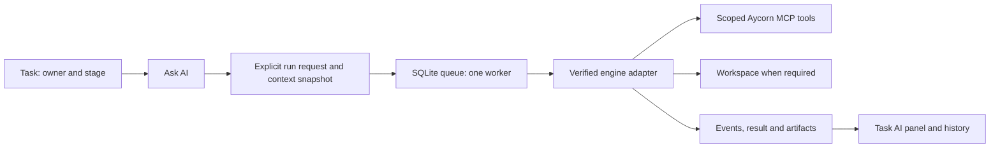

**AI integration review and replacement plan — September 5, 2026**

Reviewed repository HEAD `03b4ea7`, the Phase 0–5 documents, the Phase 2–4 implementation, and live API data from the personal development database. Recommendation: reset the AI product model around explicit task runs, retain the useful infrastructure, and rebuild the execution boundary and result experience before adding automation.

**My assessment**

The integration has grown around implementation concepts—personas, stage bindings, harnesses, tool lists, jobs, branches—before establishing a clear user interaction. The user has to understand the machinery to ask for help, and the machinery does not consistently honor the settings the interface exposes. That is the central problem. A cosmetic refresh alone would leave the confusing behavior and unreliable execution intact.

Remove stage-persona bindings from the active product now. Also remove execution triggered by changing an assignee. Removing only the stage picker would leave much of the same coupling behind. A task's owner, its workflow status, and an AI run are three independent things.

This warrants substantial replacement of Phases 2–4, but not a wholesale rewrite of Aycorn or deletion of all the AI work. SQLite job claiming, transactional completion, the MCP service integration, markdown conversion, and project-level polling are useful foundations.

**What I actually verified**

| Check | Result |
|---|---|
| `npm install` in `app/` | Completed; 719 packages added. npm reported 8 vulnerabilities: 1 low, 2 moderate, 5 high. No audit fixes applied. |
| `make dev` | Built the frontend and launched the current Go server at `http://127.0.0.1:8000`, using `/home/hal/.config/aycorn/app.db`. Database already at migration 14. |
| HTTP checks | Root HTML, personas, projects, job list, and task job history returned HTTP 200. |
| `make typecheck` | Passed. |
| `make test` | Backend suite failed in three tests; therefore this target stopped before frontend tests. |
| `make test-app` separately | Passed: 10 files, 90 tests. |
| Browser walkthrough | Blocked: computer-use inventory returned no browsers; creating an in-app tab also failed. Page observations below are from component source and live API payloads, not screenshots or rendered-browser inspection. |
| Live model execution | No new AI job submitted. Inspected existing runs and CLI startup/help without sending prompts to a model. |

The three failing tests are `TestRouting_MCPConfigPassedToReal` in `server/internal/harness/routing_test.go`, and `TestAgentRunRepo_InvalidUsageJson_ReturnsError` / `TestAgentRunRepo_ListByJob_ValidJSONVariants` in `server/internal/models/repos/agentRunRepo_test.go`. They expose mismatches between recent implementation changes and the test contracts; they are not all independent runtime failures. Most other Go packages, including worker and worktree tests, passed.

The live database had nine jobs: five failed and four completed. Three completed jobs contain explicit canned shim output; one contains real model text. Historical failures include unsupported CLI arguments, parsing NDJSON as a single JSON object, deadline expiry, and cancellation. Some historical errors have subsequent fixes in HEAD; the history demonstrates the failure modes, not that every old error remains reproducible today.

There is also a machine-level startup problem: `/home/hal/.local/bin/opencode` calls `mise use -g` and then launches `opencode` through mise. Running even `opencode --version` repeatedly printed mise messages and did not finish normally; I stopped that diagnostic process. Calling the installed executable directly at `/home/hal/.local/share/mise/installs/opencode/1.18.29/opencode` returned version `1.18.29` and CLI help immediately. This is a concrete additional reason to resolve and validate the actual executable, instead of accepting any PATH match as a healthy engine. It does not establish the cause of earlier timeouts.

**What the phases added**

| Phase | Implemented additions | Disposition |
|---|---|---|
| 0 | WAL/busy timeout, shared database foundations, compare-and-swap stage transitions | Keep; preserve concurrency guarantees. |
| 1 | Standalone MCP binary, shared services, task tools, Plate/markdown conversion | Keep and extend with enforced per-run scope. |
| 2 | Persona CRUD, rich system prompts, model/harness/agent selectors, stage bindings, personas mixed into assignees | Keep reusable instructions as optional presets; remove stage and assignee coupling and unsupported settings. |
| 3 | Job/run tables, worker, fake research loop, active job indicators and polling | Keep durable queue primitives; redesign lifecycle, triggers, failure visibility and recovery. |
| 4 | Worktrees, combined OpenCode/Claude adapter, heuristic routing, MCP config generation, budget/timeout helpers, repo path setting, Request Agent menus, drawer output | Replace execution/configuration contract and result presentation; salvage worktree creation after fixing preservation and diff capture. |

Phase 4 and follow-up commits changed 69 files with approximately 7,049 insertions and 123 deletions; this count includes tests, documentation and agent configuration. The changes span earlier-phase behavior, not just a coding adapter. The original phase documents still say “Not started” and describe a Claude-only design, human-only assignees and explicit opt-in that no longer match the implementation. Replace that obsolete contract before implementing another phase.

**The important defects, in priority order**

1. **Visible configuration is not authoritative.** The worker reads persona instructions, tool names and `Agent`, but `RunSpec` has no model or harness selection. The adapter prefers whichever `opencode` is found on PATH and otherwise uses Claude. It sends neither `--model` nor `--agent` to OpenCode. Routing also guesses from prompt wording and tool count. The Adapter pattern is appropriate; mixing two providers and heuristic fallback inside one adapter defeats its purpose. Sources: `server/internal/harness/{harness,routing,opencode}.go`, `server/internal/worker/worker.go`.

2. **The permission configuration does not establish the claimed boundary.** The generated MCP config points to `./cmd/mcp`, a source directory rather than the built executable, relative to the target worktree. It writes generic `allowedTools`/`tools` fields and passes OpenCode an Aycorn-specific `AYCORN_MCP_CONFIG` environment variable. The MCP server itself registers all nine tools without applying a per-job allowlist. Configuration generation failures are logged and execution continues. The implementation needs provider-specific configuration plus enforcement in Aycorn's MCP server. Native filesystem/shell permissions must be handled separately from Aycorn task tools. Sources: `server/internal/mcptools/config.go`, `server/cmd/mcp/{main,toolset}.go`, worker and adapter.

   Official OpenCode documentation specifies `OPENCODE_CONFIG`/`OPENCODE_CONFIG_CONTENT`, an `mcp` configuration object, and separate permission controls. It also documents configuration merging, so supplying one file does not by itself exclude ambient settings. See [configuration](https://opencode.ai/docs/config/), [MCP servers](https://opencode.ai/docs/mcp-servers/), and [permissions](https://opencode.ai/docs/permissions/). Claude has its own [CLI controls](https://code.claude.com/docs/en/cli-usage). These are separate contracts to verify against the chosen installed version.

3. **Failures can destroy the work needed for recovery.** On a harness error, the worker force-removes the worktree before collecting its diff. Keeping a branch does not preserve uncommitted edits or newly created files. An existing worktree path also triggers automatic directory removal and retry. Preserve failed and interrupted workspaces; cleanup must be an explicit, reviewable operation. Sources: `server/internal/worker/worker.go:281`, `server/internal/worktree/worktree.go:158`.

4. **Results and the UI disagree about the data contract.** The worker appends a diff to output markdown. The drawer looks for a diff in `usageJson`. The worker uses a job ID in the branch name; the UI guesses a task-ID branch because the real branch is not persisted. Even shim runs receive branch/manual-merge presentation. Diff capture lists new filenames without their content and compares against the current HEAD, so changes committed by an agent can disappear from the displayed diff. Store a real base commit, workspace, branch and patch as structured artifacts. Sources: `app/src/features/task/task-agent-runs.tsx`, worker and worktree package.

5. **Failures are effectively missing from the result experience.** Harness errors mark the job failed without creating an `agent_run`. The drawer renders runs rather than a combined job lifecycle; with no runs it labels existing jobs “queued” regardless of their status. With older successful runs present, newer failed jobs have no corresponding result card. That can make failure look like inactivity or leave an old success as the only visible result. Sources: `TaskAgentRuns`, `Worker.RunOnce`, `AgentJobService.Fail`.

6. **Assignment is being used as an execution command.** Persona identity is resolved by exact free-text name rather than stable ID. Renaming or duplicate names can change its meaning. Assignment edits enqueue jobs; stage transitions can replace the assignee and enqueue too. Client-side stage assignment rules try to preserve human owners while the bound-stage transition service overwrites the assignee. Pending-only duplicate checks exclude neither claimed nor running jobs, and the manual check/insert is not an atomic uniqueness guarantee. Sources: `server/internal/models/services/taskService.go`, `personaRepo.FindByName`, `app/src/features/task/stage-move-assignee.ts`, migration 11.

7. **Timeout, recovery and spend controls are incomplete.** The real adapter does not derive the advertised five-minute inner timeout; production execution inherits the worker's six-minute outer deadline. Stale recovery uses five minutes and runs only at startup. A recently interrupted job can therefore be too young to recover at startup and stay stuck afterward. OpenCode's budget is only an environment variable emitted by Aycorn, with no verified enforcement here. Cancellation targets the direct process without explicit process-tree management. The fake-script tests verify emitted flags/env, not whether a real engine enforces them. Sources: worker startup/loop, `agentJobRepo.ResetStale`, `harness/opencode.go`, budget and harness tests.

8. **The engine parser is still too permissive.** OpenCode output is buffered until process exit. JSONL parsing collects text and the last step-finish event, but ignores explicit error events and terminal completion semantics. Successful parsing of text is treated as a successful result if the process exits zero. Rate limiting is detected partly through arbitrary output phrases, so ordinary discussion of a “rate limit” can become a retry. Implement a provider-specific event parser with an explicit terminal result and preserve partial output on failure.

9. **Research means different things depending on hidden configuration.** `Agent == research` always uses a deterministic shim, while `code-analysis` runs a real process. The current live persona named Research is configured as `code-analysis`; historical Research completions were shims. One real completion also contains a “Sisyphus” identity, suggesting ambient agent/plugin instructions influenced it. Label simulations explicitly and make them test-only in normal operation. A research task also currently requires a Git repository even when only ticket context is needed.

10. **Earlier infrastructure needs modest cleanup.** The worker passes Plate JSON directly as task body and system prompt instead of using the existing markdown conversion seam. SQL and duplicated enqueue rules have accumulated in TaskService despite the repository-layer convention. There are duplicate `useAgentJobs` implementations with different cache keys. Deleting a persona cascades through jobs and runs in migration 11, so historical execution is dependent on mutable configuration. Preserve history when retiring presets.

**Why the interface feels bolted on**

The component source supports a strong information-design critique, even though visual spacing and responsiveness remain unverified:

- Persona cards foreground harness/model names, tool counts and bound-stage counts. They describe configuration, not what help the user can get.
- Asking for help requires discovering Request Agent, assigning a persona, and linking a repository. The initiation action does not make that dependency chain clear.
- The drawer embeds expanded run history inside the task properties collapsible, above the body. The full task page has a request action but no equivalent `TaskAgentRuns` section.
- Output is rendered as text with `whitespace-pre-wrap`; a `prose` class does not convert Markdown tables, headings or code fences into rendered content.
- Exit codes, guessed branches, Usage JSON and repeated manual-merge notices take space before providing a useful answer.
- The working indicator simultaneously spins a robot, pings a dot and pulses another dot. The code supports reduced motion, but the default still gives one state several competing animations.
- Failed, canceled, interrupted and queued states need distinct, persistent presentation. A disappearing working badge is insufficient feedback.

Keep the semantic color tokens and existing keyboard-capable primitives. The primary cleanup is hierarchy, interaction and truthful state, rather than a new color palette.

**The replacement experience**

AI belongs to the task as a tool the human deliberately invokes. Keep the task owner and stage independent. Put one **Ask AI** action in the task header and command palette; board/list menus open that same surface.

Open a task-scoped AI panel alongside the description, with an optional instruction composer and a small set of intentions: **Ask**, **Plan**, **Implement**, **Review**. These are request presets, not four autonomous agents. Start with fewer if that is enough to prove the loop. Creating or editing tasks still follows Aycorn's existing create-empty and auto-save behavior; explicitly starting an AI run is a consequential execution action, not a Save form.

Show the context before execution: this task, selected linked tasks when relevant, and the linked repository if required. Reuse the configured default engine/model. Ask/Plan can work from ticket context without forcing a repo link; code operations require one. Missing setup should produce a direct explanation and navigation to the relevant setting before enqueueing.

While working, show a quiet status, elapsed time, useful progress and Stop. On completion, lead with readable Markdown and the result. Coding runs add a file list and reviewable changes. Put engine, model, usage, raw events, branch and workspace under Details. History should show the newest attempt first and always retain failures and interrupted attempts.

Use the same AI component in the drawer and full task page. A board card only needs a compact state such as Queued, Running, Result ready or Failed that opens the relevant attempt. Do not render an expanded empty run log on every untouched task.

The initial workflow is **open task → Ask AI → choose intent/add instruction → Run → inspect progress/result → decide what to do**. Completion does not automatically change the task stage or overwrite the description. Applying text to a task should be an explicit action using the existing markdown/Plate conversion. Code review should expose the actual workspace/branch and changes; merge automation can wait.

Reusable personas may survive as optional **instruction presets** under AI settings. Preserve their names and prompts; remove stage ownership, human-assignee impersonation and execution routing by name. Runtime configuration belongs in engine settings, and per-run permissions belong in the execution policy. Avoid migrating persona display names automatically into human owners.

**The replacement system**

Use an explicit run request containing task ID, instruction, optional preset ID, selected engine/model and capabilities. Persist the resolved context and configuration so editing a preset does not rewrite the meaning of a queued or historical run. Keep provider selection deterministic; no fallback to another vendor, shim or agent because a prompt contains a keyword.

Keep one durable queue and one worker. Model queued, running, succeeded, failed, canceled and interrupted outcomes explicitly. Claiming can remain an internal state. Use atomic duplicate prevention for active work on a task, separate immutable attempt IDs on retry, consistent terminal transitions, and a recovery rule that cannot strand young jobs or silently repeat uncertain coding work. Do not auto-retry an interrupted coding attempt before reconciling its workspace.

Persist structured run metadata and artifacts: engine/version/model, context snapshot, timings, outcome/error, usage if available, real workspace path, branch, base commit, output, patch and validation results. Keep raw provider events separate from usage and diff. Reuse the existing job/run tables where practical; do not introduce a second competing execution store merely to rename concepts.

Use the Adapter pattern properly: one provider implementation owns command arguments, config schema, event parsing, cancellation, permissions and supported limits. First validate OpenCode directly against the installed executable because that is the current configured engine. Retain it if it passes the contract. If it cannot meet required controls, evaluate a separate Claude adapter through the same acceptance tests. Do not choose a replacement based on the stale phase document's archived-OpenCode claim.

Scope the MCP server at registration and execution to the permitted tools and task/project context; configure its absolute executable and exact database explicitly. Test forbidden calls directly. A worktree isolates changes from the user's working checkout but is not an OS sandbox: native shell/filesystem access requires its own enforceable policy. If stronger confinement is required, select an actual isolation mechanism rather than describing a working directory as one.

Capture artifacts against the recorded base commit, including new files and commits made during execution. Preserve partial output and dirty workspaces after cancellation, timeout or error. Keep operational configuration outside the tracked workspace. Make cleanup explicit and confirmed when it can discard work.

Start with the existing polling approach, consolidated under one feature/cache-key convention. Add persisted progress events with polling first; SSE is optional if that proves inadequate. No message broker, distributed orchestrator, multi-agent graph or new state library is needed.

**Implementation sequence and completion gates**

| Step | Scope | Done when |
|---|---|---|
| 1. Freeze and document the contract | Mark old architecture/phases superseded; record the manual-run model; inventory existing bindings, personas, history and worktrees; choose initial engine after preflight. | One authoritative design explains what starts a run, what it can access and what survives failure. No new automation work starts from obsolete docs. |
| 2. Remove hidden execution | Remove stage bindings from UI/runtime and remove enqueue-on-assignee behavior across HTTP, MCP, single and bulk paths. Retain old bindings as inactive migration data initially. Keep existing ownership values for review. | Moving tasks, editing owners, renaming presets and bulk updates start zero AI jobs. Explicit Run is the only trigger. |
| 3. Prove one real engine | Resolve actual executable; bounded health/version check; honor model/instructions; provider config; enforced tool scope; real terminal event parsing; timeout/process-tree cancellation; honest supported-budget behavior. Convert Plate to Markdown. | A disposable ticket/repo smoke run reads allowed context, cannot call a forbidden tool, honors the selected configuration, streams/persists progress and stops correctly. Simulation is confined to tests. |
| 4. Repair lifecycle and artifacts | Atomic active-job prevention, snapshots, retry attempts, restart recovery, all-outcome records, preserved workspaces, full patches and structured metadata. | Double-click/concurrent requests do not duplicate active work; restart/cancel/failure loses neither output nor edits; committed and new-file changes are reviewable. |
| 5. Build the task AI experience | Shared panel, one entry action, intent presets, readable output, quiet status, Stop/Retry, failure details, changes and collapsed diagnostics. Engine settings show real readiness. | Drawer and full page expose the same results; keyboard-only initiation/cancel/retry works; mobile and light/dark layouts pass an actual browser walkthrough. |
| 6. Migrate and harden | Preserve historical runs independently of persona deletion; migrate only trustworthy artifacts; unify query hooks; move SQL back into repositories; reconcile stale tests; update schema reference/docs. | Existing personal data remains readable, old missing metadata is labeled unknown, relevant tests pass, and real CLI acceptance checks cover the previous failures. |

Implement these as small end-to-end slices rather than completing all backend work before designing the interaction. A simple task-only Ask run is the first usable slice. Then add Implement with preserved artifacts, followed by Review and reusable presets as needed.

Do not rewrite already-applied migrations 9–14 or drop the old data to make the new schema easier. Add forward migrations. These proposed run states do not require changing `task.priority`, `task.type` or `stage.type` CHECK constraints. Any actual change to those allowed values would require the project's separate table-migration process.

**What stays deferred**

Stage automation, automatic handoffs, multiple simultaneous workers, persona-specific workflows, automatic stage completion and automatic merging. Reintroduce stage automation only after explicit runs are dependable in normal use. If it returns, model it as a separately configured rule invoking the same run-request service, with clear opt-in, rather than embedding execution in stage identity again.

The first milestone should be demonstrable in one sentence: **I can open any task, deliberately ask a working AI for help, see what it is doing, stop it, and reliably inspect everything it produced.** That is the foundation the current phases have not yet completed.
